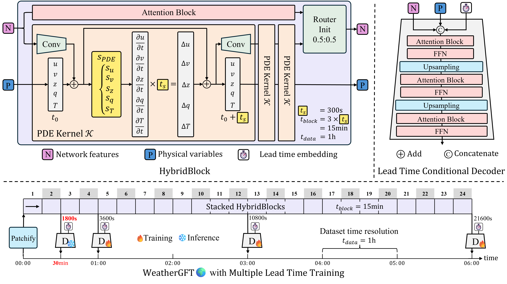
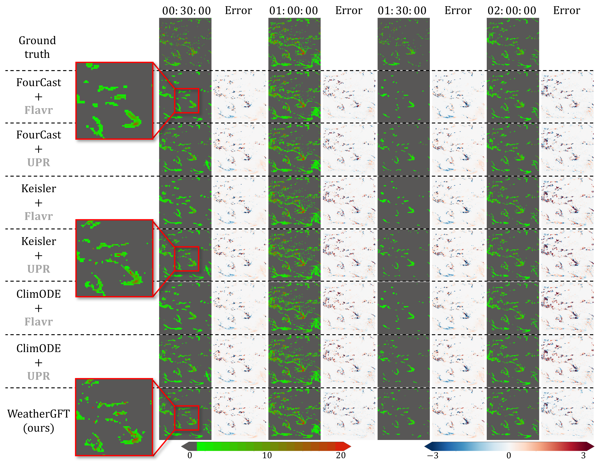

<!-- # WeatherGFT🌍: Generalizing Weather Forecast to Fine-grained Temporal Scales via Physics-AI Hybrid Modeling -->

<div align="center">
  <h2><b> (NeurIPS'24) WeatherGFT🌍: Generalizing Weather Forecast to Fine-grained Temporal Scales via Physics-AI Hybrid Modeling
  </b></h2>
</div>

## Updates/News 🆕

🚩 **Updates** (2024-11-19) The model training code is open source.

🚩 **Updates** (2024-10-10) The model code **`Models/WeatherGFT.py`** has been released, with more codes set to follow in due course. The model's checkpoint and example of input data have been uploaded to [Google Drive](https://drive.google.com/drive/folders/1fZlr0LS3aFJAym79ojn3njYiUhtdzKF6?usp=sharing).

🚩 **News** (2024-09-26) WeatherGFT🌍 has been accepted by **NeurIPS 2024** 🎉. The code and the camera-ready version will be released soon.

🚩 **Updates** (2024-05-22) Initial upload to arXiv [[PDF]](https://arxiv.org/pdf/2405.13796).

## Visualization 🌟

<!-- https://github.com/black-yt/WeatherGFT/assets/82664952/64094e86-0bf6-4bb7-a520-7b82dc06e2a8 -->
<!-- https://github.com/user-attachments/assets/ba5a9582-82e6-4e74-a710-788e17139476 -->
https://github.com/user-attachments/assets/560bc030-f0b4-48de-af56-7fdccf7d912e


## Abstract 🗂️

Data-driven artificial intelligence (AI) models have made significant advancements in weather forecasting, particularly in medium-range and nowcasting. However, most data-driven weather forecasting models are black-box systems that focus on learning data mapping rather than fine-grained physical evolution in the time dimension. Consequently, the limitations in the temporal scale of datasets prevent these models from forecasting at finer time scales. This paper proposes a **physics-AI** hybrid model (i.e., WeatherGFT) which Generalizes weather forecasts to Finer-grained Temporal scales beyond training dataset. Specifically, we employ a carefully designed PDE kernel to simulate physical evolution on a small time scale (e.g., 300 seconds) and use a parallel neural networks with a learnable router for bias correction. Furthermore, we introduce a lead time-aware training framework to promote the generalization of the model at different lead times. The weight analysis of physics-AI modules indicates that physics conducts major evolution while AI performs corrections adaptively. Extensive experiments show that WeatherGFT trained on an hourly dataset, achieves state-of-the-art performance across multiple lead times and exhibits the capability to generalize 30-minute forecasts.

## Physics-AI Hybrid Model 🧭



## Contributions ✅

* We propose a physics-AI hybrid model that incorporates physical PDEs into the networks, enabling the simulation of fine-grained physical evolution through its forward process.
* With the flexible PDE kernel and new lead time-aware training framework, our model performs multiple lead time forecasts, which bridges the nowcast and medium-range forecast.
* For the first time, our model extends the forecasting ability learned from an hourly dataset to make accurate predictions at a finer time scale, i.e., 30 minutes.
* Our model achieves state-of-the-art (SOTA) performance in forecast tasks at different time scales, ranging from nowcast to medium-range forecast.

## Skillful Medium-Range Forecasts 🌤️

From the visualization, our model is more accurate in predicting the subtropical high, as indicated by the highlighted red box. In addition, the prediction error of our model at the lead time of 6-hour is significantly smaller than that of the physical dynamic model ECMWF-IFS. 


## Generalizing to Fine-grained Time Scale for Nowcasting 🌧️

In contrast to conventional black-box AI models used in medium-range weather forecasting, WeatherGFT has the ability to break through the time scale limitations of the dataset, making the generalization to fine-grained temporal scales possible. This capability is facilitated by the dynamic progression of our PDE kernel modeling and multiple lead time training.

To quantify the accuracy of the model's generalized nowcasting, we utilize the satellite precipitation observation dataset from [NASA](https://disc.gsfc.nasa.gov/) as the ground truth, which has a time resolution of 30-minute. We evaluate forecasts at 30, 60, 90, and 120 minutes. It is important to note that data of NASA were not used for training. For other comparison models that cannot directly produce half-hour forecasts, we use the frame interpolation models (i.e., [Flavr](https://github.com/tarun005/FLAVR) and [UPR](https://github.com/srcn-ivl/UPR-Net)) to generate 30-minute predictions.




## BibTeX

```bibtex
@article{xu2024generalizing,
  title={Generalizing Weather Forecast to Fine-grained Temporal Scales via Physics-AI Hybrid Modeling},
  author={Xu, Wanghan and Ling, Fenghua and Zhang, Wenlong and Han, Tao and Chen, Hao and Ouyang, Wanli and Bai, Lei},
  journal={arXiv preprint arXiv:2405.13796},
  year={2024}
}
```